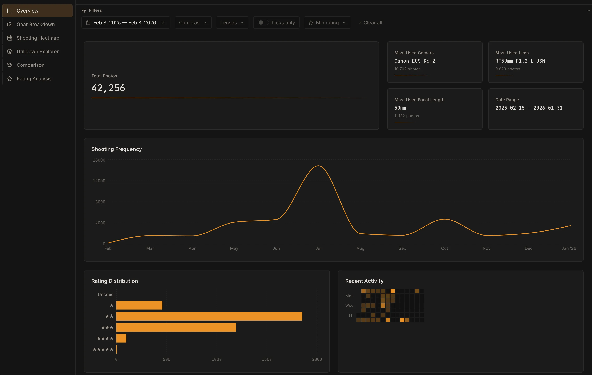
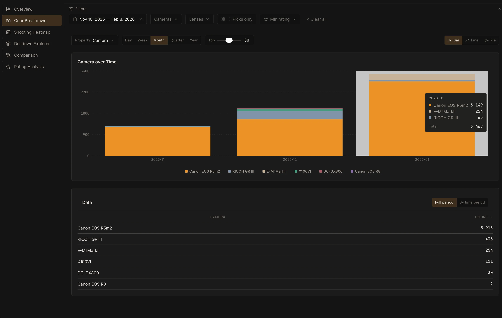
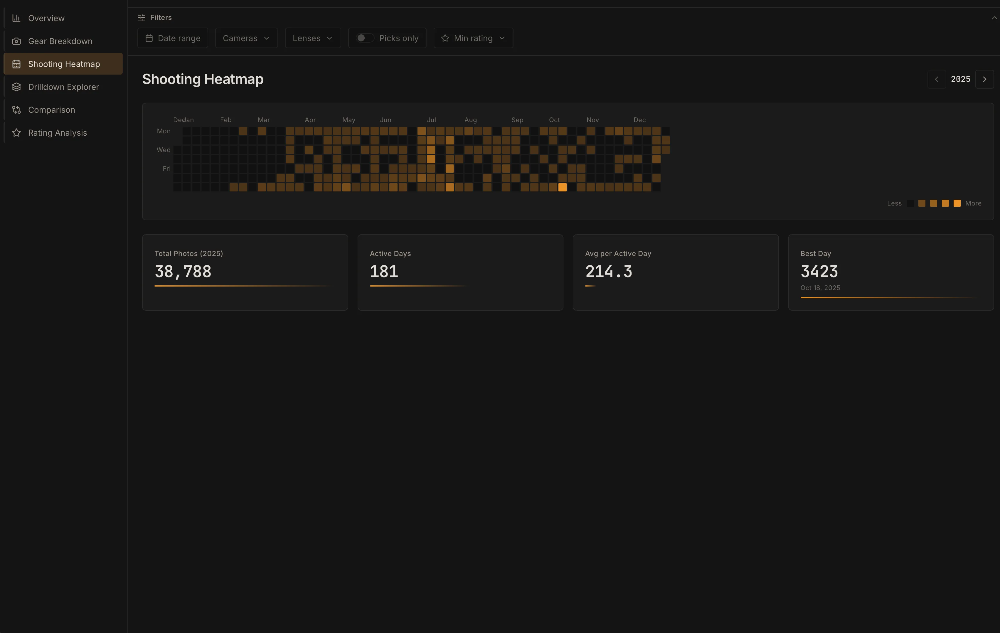
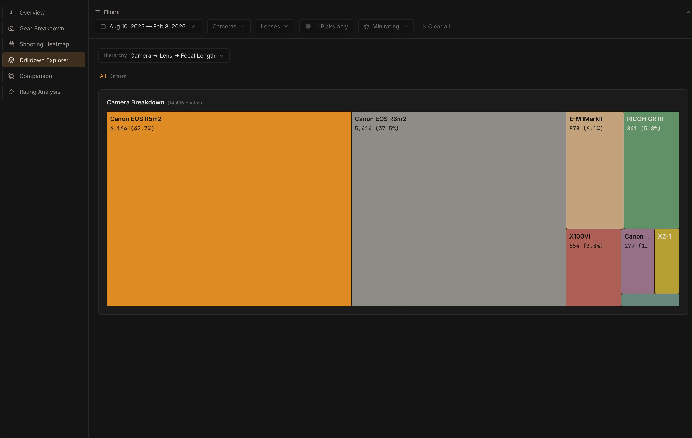
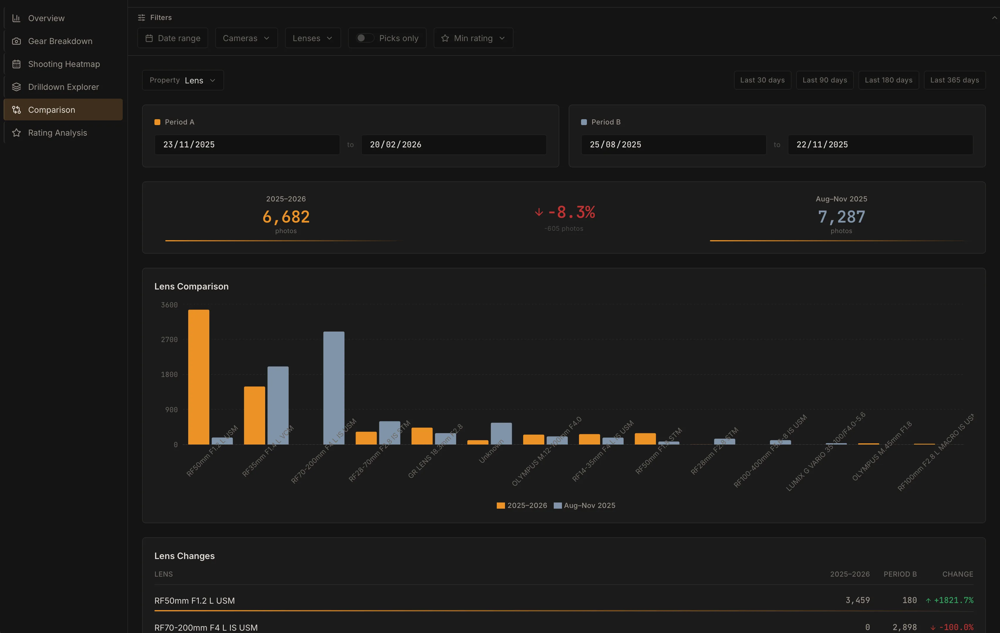
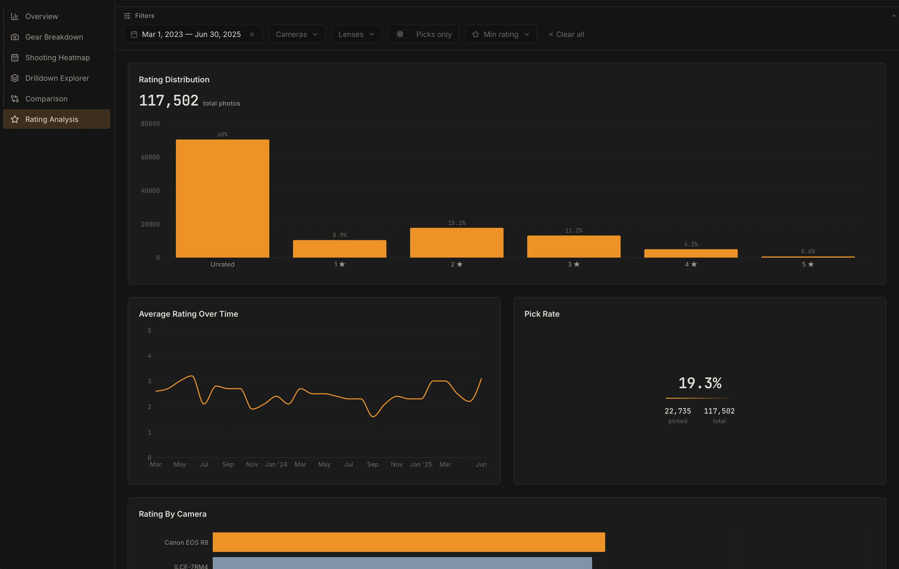

# Lightroom Analytics

A self-contained web app for analyzing **Adobe Lightroom Classic** catalog files (`.lrcat` SQLite databases). Get an interactive dashboard with charts, drilldowns, filtering, and stats on your photo metadata. No database, no auth — it reads your catalogs from a folder and caches everything in memory.

## Security and Catalog Safety

- Do **not** expose this app directly to the public internet with your real catalog data. It is designed for local/trusted-network use, and publishing it can expose your photo metadata to anyone.
- Even if you intentionally want to share catalog metadata publicly, direct internet exposure is still discouraged unless you really understand what risks you are exposing yourself to.
- Use a **copy** of your Lightroom catalog only. Never point this app at your original working `.lrcat`.
- Mount catalogs read-only in Docker (`:ro`) and keep your original Lightroom catalog untouched.

## Demo

Try it without installing anything: check out the **[live demo](https://lightroom-analytics.hawi.me)**. It runs with fake data so you can explore the dashboard, charts, drilldowns, and filters before running it with your own catalog.

## Quick start (Docker)

Pull and run the image from GitHub Container Registry. Mount a directory that contains your `.lrcat` file(s):

```bash
docker run -d \
  --name lightroom-analytics \
  -p 127.0.0.1:8118:8118 \
  -v /path/to/your/catalogs-copy:/catalogs:ro \
  ghcr.io/pppontusw/lightroom-analytics:latest
```

Then open **http://localhost:8118** in your browser.

- Replace `/path/to/your/catalogs-copy` with a folder containing **copies** of your Lightroom catalog (`.lrcat`) files. Do not use your original working catalog.
- Use a read-only mount (`:ro`). The app opens catalogs in SQLite read-only mode and does not write catalog data.
- The app listens on port **8118** by default.
- `127.0.0.1:8118:8118` keeps it local-only on the host by default.

### Docker Compose

Create a `docker-compose.yml` (adjust the host path under `volumes` to where your `.lrcat` lives):

```yaml
services:
  lightroom-analytics:
    image: ghcr.io/pppontusw/lightroom-analytics:latest
    ports:
      - "127.0.0.1:8118:8118"
    volumes:
      - /path/to/your/catalogs-copy:/catalogs:ro
    # Optional: override defaults
    # environment:
    #   CATALOG_DIR: /catalogs
    #   CACHE_REFRESH_HOURS: "4"
    #   LOG_LEVEL: info
    restart: unless-stopped
```

Then run:

```bash
docker compose up -d
```

Open **http://localhost:8118**. To refresh the catalog cache without restarting, use the refresh control in the app or restart the service: `docker compose restart lightroom-analytics`.

## Configuration

All settings are via environment variables. None are required for basic use.

| Variable | Default | Description |
|----------|---------|-------------|
| `CATALOG_DIR` | `/catalogs` | Directory to scan for `.lrcat` files (use the same path as in your `-v` mount). |
| `PORT` | `8118` | Server port inside the container (map it with `-p` as above). |
| `CACHE_REFRESH_HOURS` | `4` | Hours between automatic cache refreshes. |
| `REFRESH_COOLDOWN_SECONDS` | `300` | Minimum seconds between manual `POST /api/refresh` calls. |
| `REFRESH_RATE_LIMIT_PER_MINUTE` | `10` | Max manual `POST /api/refresh` attempts per client IP per minute. |
| `LOG_LEVEL` | `info` | Logging: `debug`, `info`, `warning`, `error`. |

Example with custom catalog path and refresh interval:

```bash
docker run -d \
  --name lightroom-analytics \
  -p 127.0.0.1:8118:8118 \
  -e CATALOG_DIR=/catalogs \
  -e CACHE_REFRESH_HOURS=2 \
  -e REFRESH_COOLDOWN_SECONDS=300 \
  -e REFRESH_RATE_LIMIT_PER_MINUTE=10 \
  -v /path/to/your/catalogs-copy:/catalogs:ro \
  ghcr.io/pppontusw/lightroom-analytics:latest
```

## Public exposure

Default examples are localhost-only on purpose. If you intentionally publish a demo:

- Put it behind a reverse proxy with TLS.
- Add authentication (at minimum HTTP basic auth at the proxy).
- Keep `/api/refresh` protected from anonymous internet access.
- Do not expose container port `8118` directly to `0.0.0.0` unless you accept that risk.

## What you get

- **Overview** — Totals, date range, top cameras/lenses.
- **Gear breakdown** — Camera and lens usage, focal length, aperture, shutter speed.
- **Shooting heatmap** — When you shoot over time.
- **Drilldown explorer** — Filter and slice by catalog, date, camera, lens, etc.
- **Comparison** — Compare metrics across catalogs or segments.
- **Rating analysis** — Star ratings and pick flags.

Filters (date range, picks only, min rating, exclude cameras) are applied across views and can be stored in the URL.

## Requirements

- **Lightroom Classic** catalogs (`.lrcat`). The app reads the SQLite DB and EXIF-derived metadata; it does not need access to your photo files.
- Single-user, local/network use — no login. Keep the app on a trusted network.

## Image tags

- `ghcr.io/pppontusw/lightroom-analytics:latest` — latest release (use this for “just run it”).
- Replace `:latest` with a specific version tag if you pin releases.

## Screenshots

**Overview**



**Gear breakdown**



**Shooting heatmap**



**Drilldown explorer**



**Comparison**



**Rating analysis**



## License

This project is licensed under the [MIT License](LICENSE).
